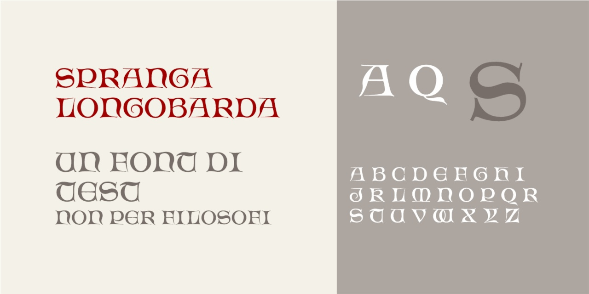

# Spranga Longobarda
- Versione 1.0: versione iniziale.

Per testare il font, vedere la [pagina interattiva](https://m-casanova.github.io/SprangaLongobarda/).

È solo un font sperimentale.

## Descrizione

Il font **Spranga Longobarda** è basato su scansioni di disegni di [Albert Angus Turbayne](https://catalog.hathitrust.org/Record/103060432) (1866-1940).

Sono presenti varianti per le lettere _T W_, accessibili tramite caratteristica '**ss01**'.

